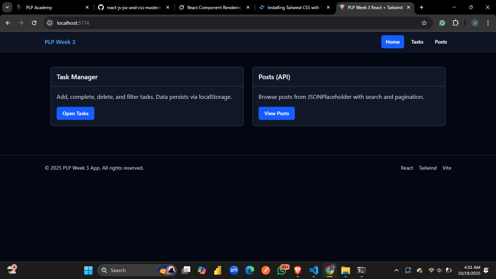
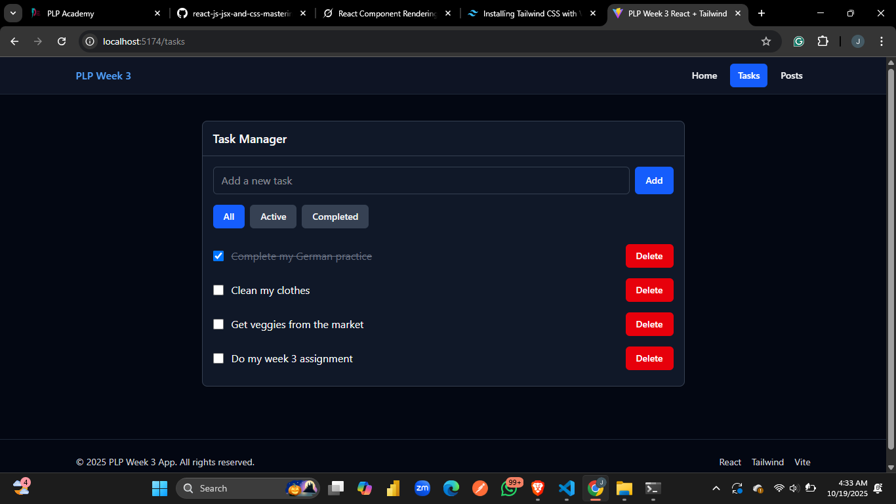
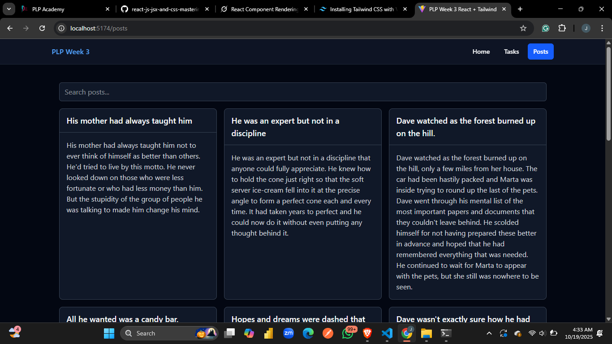

## Week 3 Assignment Report

### Overview
- Project set up with Vite + React and Tailwind CSS
- Routing with React Router: Home, Tasks, Posts, and 404 fallback
- Reusable UI components: Button (variants), Card, Navbar, Footer, and a Layout wrapper
- Theme: Dark mode enforced across the app
- Custom hook: useLocalStorage for persisting data
- Task Manager: add, complete, delete, and filter tasks (All/Active/Completed); data persists in localStorage
- Posts page: fetches 20 posts from DummyJSON, with search and pagination (2 pages total)
- Responsive design using Tailwind utility classes


### Live Demo
https://vercel.com/jane-njoroges-projects/mern-wk3/4xShpqodrtwW5i2VfKGnqKkhpLFA

### How to run
Prerequisites: Node.js 20.19+ or 22.12+ recommended.

PowerShell:
```powershell
cd .\wk3-mern\
npm install
npm run dev
```

Then open the Local URL shown in the terminal (for example, http://localhost:5174).

Navigation:
- Home: overview and quick links
- Tasks: Task Manager features
- Posts: API data with search and pagination

---

## Screenshots




